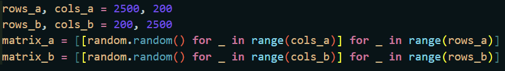
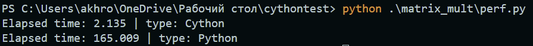

Example of Cython using


# Comparison of the speed of code for matrix multiplication in standard Python and with Cython

## C Code
- [.c file](matrix_mult/lowlevel/matr_m.c)
- [.pyx file](matrix_mult/matr_mult.pyx)

## Python Code
- [.py file line 5:11](matrix_mult/perf.py)

## Matrices for comparison


## Comparison results
```bash
Elapsed time: 2.135 | type: Cython
Elapsed time: 165.009 | type: Python

Cython is faster than Python ~ about 77 times ( in this case )

```



#### Averages:
-----
```go
matrix sizes 521 x 241 and 241 x 652 | num_iterations = 100 

Average cython time: 0.1339475417137146
Average cython time: 9.9339475417137146
```


#### Table:
---

| Matrix A Size | Matrix B Size | Iterations | Cython | Python |
| ------------- | ------------- | ---------- | ------ | ------ |
| 521 x 241 | 241 x 652 | 100 | 0.1339475417137146 sec| 9.9339475417137146 sec|
| 2500 x 250 | 250 x 2500 | 1 | 2.135 sec | 165.009 sec|

